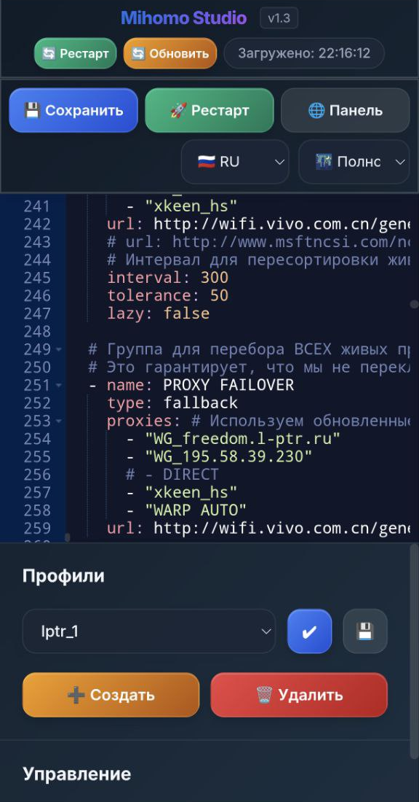
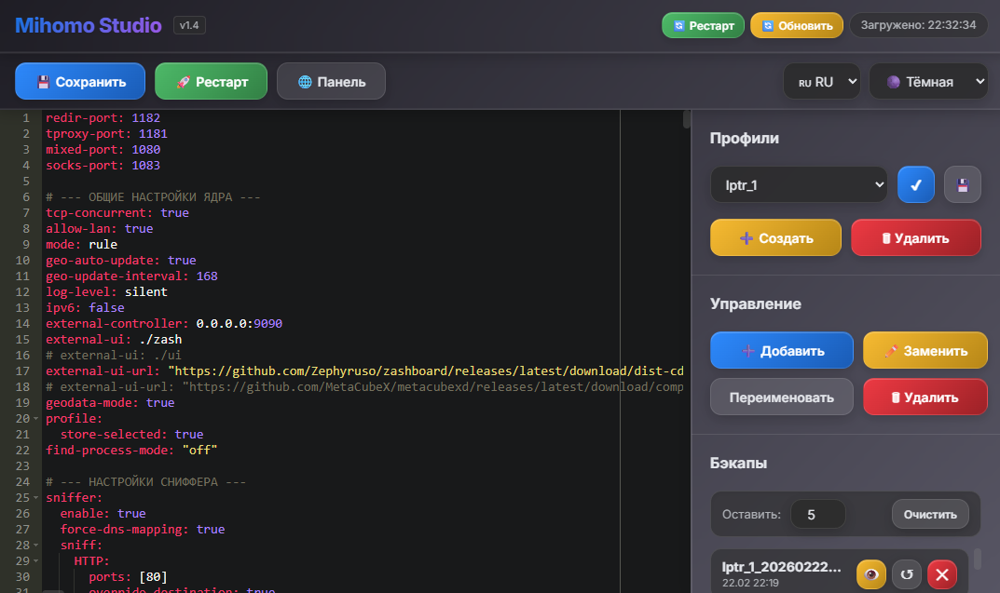

# Mihomo Studio for Keenetic/Netcraze

**Mihomo Studio** — это легковесный веб-интерфейс для удобного управления конфигурациями [xkeen](https://github.com/jameszeroX/XKeen/tree/main) [Mihomo](https://github.com/MetaCubeX/mihomo) на вашем устройстве (например, роутере Keenetic). Он позволяет редактировать конфигурационные файлы, добавлять и управлять прокси, переключаться между профилями, создавать бэкапы и перезапускать сервис Mihomo прямо из браузера.

Скрипт написан на чистом Python с использованием стандартной библиотеки `http.server` и не требует тяжелых зависимостей, что делает его идеальным для систем с ограниченными ресурсами.

## 🚀 Основные возможности

*   **Парсеры конфигураций**:
    *   **VLESS**: Добавление прокси напрямую из ссылки `vless://`. Имя прокси извлекается автоматически.
    *   **WireGuard**: Добавление прокси из `.conf` файлов или текста конфигурации.
    *   **AmneziaWG**: Полная поддержка специфичных параметров Amnezia (Jc, Jmin, Jmax, S1/S2, H1-H4, I1 и др.) с корректным переносом в конфиг.

*   **Управление прокси**:
    *   **Добавление**: Интерактивное добавление VLESS или WireGuard прокси в выбранные группы.
    *   **Удаление**: Безопасное удаление прокси из `proxies` и всех `proxy-groups`.
    *   **Замена**: Полная замена данных одного прокси на новые (например, обновить VLESS).
    *   **Переименование**: Корректное переименование прокси во всех секциях конфигурации.

*   **Управление профилями**:
    *   Создание новых профилей конфигурации.
    *   Быстрое переключение между профилями через систему символических ссылок.
    *   Скачивание и удаление неиспользуемых профилей.

*   **Бэкапы и восстановление**:
    *   Автоматическое создание бэкапа активного профиля перед каждым сохранением.
    *   Просмотр содержимого бэкапов.
    *   Восстановление конфигурации из любого бэкапа в один клик.
    *   Настраиваемая очистка старых бэкапов.

*   **Интеграция с системой**:
    *   Перезапуск сервиса Mihomo (`xkeen -restart`) прямо из веб-интерфейса.
    *   Просмотр лога последнего перезапуска для быстрой диагностики.
    *   **Встроенный прокси для панели Mihomo**: Доступ к стандартной веб-панели (YACD/Metacubexd) через `Mihomo Studio` без ошибок CORS/PNA.
    *   **Обновление в один клик**: Возможность обновить сервис и скрипт управления прямо из веб-интерфейса.

*   **Интерфейс (v1.3)**:
    *   **Новый дизайн**: Современный стиль (Mockup/Material) с улучшенной эргономикой, тенями и анимациями.
    *   Встроенный редактор ACE с подсветкой синтаксиса YAML.
    *   Поддержка тем: Тёмная, Светлая, Полночь, Кибер.
    *   Многоязычность: 🇷🇺 Русский, 🇺🇸 Английский, 🇺🇦 Украинский.
    
<p align="center">
  
  
</p>

## 🛠️ Установка

Установка состоит из двух этапов: сначала устанавливается управляющий скрипт `mhstudio`, а затем с его помощью — сам веб-сервис.

1.  **Установка управляющей команды**

    Выполните в консоли вашего устройства:    

    Установите wget с поддержкой ssl:
    ```bash
    opkg update
    opkg install wget-ssl
    ```
    Выполните установочный скрипт:
    ```bash
    wget -O - https://raw.githubusercontent.com/l-ptrol/mihomo_studio/master/install.sh | sh
    ```
    Эта команда скачает и установит скрипт [`mhstudio.sh`](./mhstudio.sh) в `/opt/bin/mhstudio`, делая команду `mhstudio` доступной в системе.

2.  **Установка веб-сервиса**

    После установки управляющей команды, просто запустите её без аргументов:
    ```bash
    mhstudio
    ```
    Скрипт автоматически проверит и установит необходимые зависимости (python3), скачает основной файл сервиса [`mihomo_editor.py`](./mihomo_editor.py:1) и скрипт автозапуска, после чего запустит веб-интерфейс.

    По умолчанию, **Mihomo Studio** будет доступен по адресу `http://<IP-вашего-роутера>:8888`.

## ⚙️ Управление сервисом

Все действия выполняются с помощью команды `mhstudio`.

*   `mhstudio -start`
    Запустить сервис Mihomo Studio.

*   `mhstudio -stop`
    Остановить сервис.

*   `mhstudio -restart`
    Перезапустить сервис.

*   `mhstudio -update`
    Проверяет наличие новой версии и, если она доступна, обновляет сервис (включая сам скрипт управления).

*   `mhstudio -reinstall`
    Принудительно скачивает и переустанавливает последнюю версию сервиса.

*   `mhstudio -uninstall`
    Удаляет сервис (скрипты и автозапуск), но **сохраняет** установленные пакеты `python3`.

*   `mhstudio -uninstall-full`
    Полностью удаляет сервис и все его зависимости. **Внимание**: это может затронуть другие приложения, использующие Python.

## 📄 Структура файлов

*   `/opt/bin/mhstudio` — Главный управляющий скрипт.
*   `/opt/scripts/mihomo_editor.py` — Основной файл веб-сервера и всей логики.
*   `/opt/etc/init.d/S95mihomo-web` — Init-скрипт для автозапуска сервиса при старте системы.
*   `/opt/etc/mihomo/config.yaml` — **Символическая ссылка** на текущий активный профиль.
*   `/opt/etc/mihomo/profiles/` — Директория, где хранятся все ваши файлы профилей (`.yaml`).
*   `/opt/etc/mihomo/backup/` — Директория для автоматического сохранения бэкапов.

## 💡 Особенности реализации

*   **Веб-сервер**: Написан на Python 3 с использованием модуля `http.server`, что обеспечивает минимальное потребление ресурсов.
*   **Профили**: Система профилей реализована с помощью симлинков. Файл `config.yaml` является лишь ссылкой на один из файлов в `/opt/etc/mihomo/profiles/`. Это позволяет Mihomo "видеть" всегда один и тот же конфиг, в то время как `Mihomo Studio` просто меняет, на какой файл он указывает.
*   **Безопасность**: Скрипт предназначен для работы в локальной сети и не имеет механизмов аутентификации. Не рекомендуется открывать доступ к порту `8888` извне.
